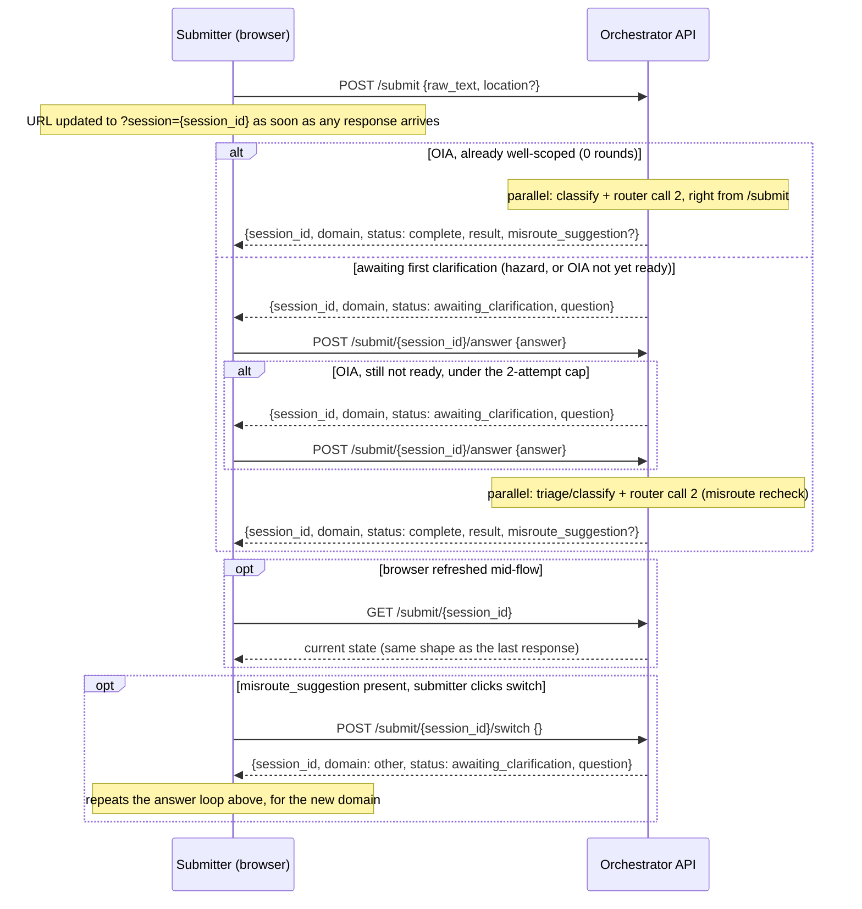

# Frontend plan

Design only — not built. Blocked on Phase 4 (`PLAN.md`) landing with the
API contract below, since the UX needs the graph to expose intermediate
state, not just a final result.

## UX flow

1. **Generic intake** — one text box, no domain picker. Submitter doesn't
   know or state whether it's a hazard or an OIA request.
2. **Domain reveal** — once the router node runs, show it: *"This looks like
   a hazard report"* / *"This looks like an OIA request."* Not editable by
   the submitter — the router's call, not theirs.
3. **Domain-specific clarification — the two paths are NOT the same
   shape.**
   - **Hazard path** — exactly one question, always (see README —
     `hazard_subgraph`'s Clarifier deliberately never loops or skips).
   - **OIA path** — `oia_subgraph` loops `clarify` until the request reads
     as ready, capped at 2 attempts — but can also signal "ready" on the
     very first call, so a well-scoped request skips clarification
     entirely (0 rounds). Each call can return 1-3 questions at once; the
     submitter answers all of them via **one combined free-text field**
     per round (mirrors the real OIA frontend's `additionalInfo` box), not
     per-question. This needs a retrain of the OIA project's Clarifier
     that doesn't exist yet — see `PLAN.md` Phase 3.
4. **Result + misroute suggestion** — hazard path shows severity/rationale
   (mirrors `wellington-impact-lab`'s existing detail panel); OIA path
   shows the assigned agency. Alongside it, if the parallel misroute
   recheck (README's Data flow) disagreed with the original domain, show:
   *"This looks like it might fit better as a [hazard report/OIA
   request]"* with a **"Submit as hazard report"** / **"Submit as OIA
   request"** button. The already-computed result is still shown
   regardless — the suggestion never blocks or replaces it.
5. **On switch click** — always restart at the *other* pipeline's first
   clarification step (`ask` or `clarify`), never skip straight to its
   result. Same behavior regardless of how far the original path had
   gotten.

## API contract this requires (drives Phase 4's build)

The graph currently only supports run-to-completion (`ainvoke`). This UX
needs pause/resume — same `interrupt_before` mechanism discussed for the
hazard `ask`→`act` gap, now needed at **every** clarify-style node
(`hazard_subgraph`'s `ask`, `oia_subgraph`'s `clarify`), plus a
checkpointer keyed by session so a second request can resume the right
paused graph.

```
POST /submit
  { raw_text, location? }
  -> { session_id, domain, status: "awaiting_clarification" | "complete",
       question?, result?, misroute_suggestion? }
  -- "complete" here (not just after /answer) is the 0-round OIA case: a
     well-scoped request skips clarification entirely. Frontend must
     handle both statuses on this very first response, not assume
     "awaiting_clarification" always comes first.

GET /submit/{session_id}
  -> same shape as above, current state, no mutation — safe/idempotent.
     Used on browser refresh instead of re-POSTing anything.

POST /submit/{session_id}/answer
  { answer }
  -> same shape as above — hazard always completes; OIA may loop
     (another question, status stays "awaiting_clarification") up to
     2 attempts before forcing completion — see PLAN.md Phase 3

POST /submit/{session_id}/switch
  {}  -- confirms the misroute_suggestion, no body needed
  -> restarts at the other domain's first clarification step:
     { session_id, domain: <the other domain>, status: "awaiting_clarification",
       question }
```

`domain`, `question`, and `misroute_suggestion` are read straight off graph
state after each pause, same as `main.py`'s existing `_triage()` reads
parsed model output — no new judgement calls, just surfacing what the graph
already decided. `misroute_suggestion` is only present on a `"complete"`
response where the parallel recheck (router call 2) disagreed with the
original domain — null otherwise.

**Refresh-safety:** `session_id` is reflected in the browser URL
(`?session={id}`) as soon as the first response arrives. A refresh reads it
back out and calls `GET /submit/{session_id}` to restore state — never
re-POSTs, since `/answer` and `/switch` are real mutations and would misfire
if replayed accidentally.

**On REST style:** `/answer` and `/switch` are verb-style action endpoints
rather than pure noun resources — a deliberate, pragmatic choice, not an
oversight. Matches `wellington-impact-lab`'s own
`POST /events/{id}/clarification-answer` convention, kept consistent across
both systems rather than forcing textbook resource-CRUD naming here.

## Sequence diagram



## Stack

Svelte 5 (runes) + Tailwind + pnpm — consistent with
`wellington-impact-lab`'s frontend, same tooling already in use.

## Checklist

- [ ] Add `interrupt_before` + a durable checkpointer (see `PLAN.md` Phase
      4 — not `MemorySaver`, doesn't survive the orchestrator's own
      multi-instance Cloud Run deployment) to the parent graph
- [ ] Add the parallel misroute-recheck node (README's Data flow) to both
      subgraphs, feeding `misroute_suggestion` into graph state
- [ ] `POST /submit` / `GET /submit/{session_id}` /
      `POST /submit/{session_id}/answer` / `POST /submit/{session_id}/switch`
      on the orchestrator service
- [ ] Svelte scaffold: intake form → domain reveal → clarify loop → result
      panel + switch suggestion
- [ ] Reflect `session_id` in the URL on first response; on load, if
      present, call `GET /submit/{session_id}` instead of showing the
      intake form
- [ ] Point at deployed `router-service` + Phases 2/3's subgraphs once all
      exist
